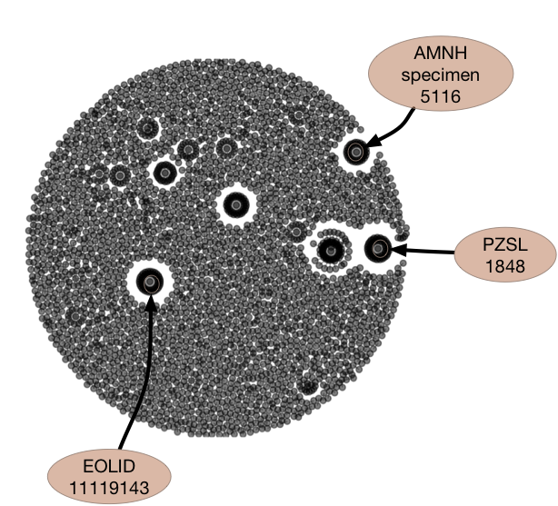

# id-link-template

Fork of the template repo for phoibos2 workshop: this one contains several
records that participants found and recorded in our Google Doc.

fork this repo and edit the `id_links.csv` file and add your links.

This repository takes an inaturalist observations of a Sea otter (_Enhydra lutris_) and how it is used in GBIF, GloBI and GBIF and GloBI link this to taxon "ids" and other linked resources.

See some notes on calculating PageRank with the linked identifiers, please see these [notes](./NOTES.md).

The [notes](./NOTES.md) provide some context for the graph below.

**Click on figure to show animated construction of force-directed network diagram in a browser**.

.

